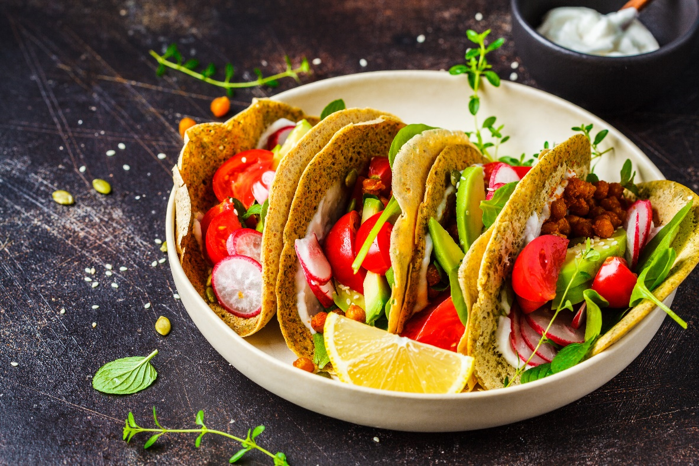

**5 famous Mexican dishes**

When it comes to Mexican cuisine, the options are endless. However, there are a few dishes that stand out among the rest. Here are 5 famous Mexican dishes that you must try:

**Tacos** Whether you prefer crunchy shells or soft tortillas, tacos are a staple of Mexican cuisine. Filled with meat, vegetables, cheese, and salsa, tacos are a delicious and customizable option for any meal.

**Tres Leches** This decadent dessert is a sponge cake soaked in three types of milk – evaporated milk, condensed milk, and heavy cream. Topped with whipped cream and fruit, Tres Leches is the perfect sweet ending to any meal.

**Enchiladas** Rolled up tortillas filled with meat, cheese, and sauce, enchiladas are a classic Mexican dish. Topped with even more sauce and cheese, they are a delicious and filling option.

**Tamales** These steamed corn husks filled with pork, chicken, or vegetables are a favourite during holidays and special occasions in Mexico. They may take some time to make, but the taste is well worth the effort.

**Mole** A rich and flavourful sauce made with chili peppers, spices, nuts, and chocolate, mole is often served over chicken or beef. It’s a complex dish with a unique taste that is not to be missed.

In conclusion, if you haven’t tried these famous Mexican dishes, you are missing out on a world of flavour. So go ahead and indulge in some tacos, tres leches, enchiladas, tamales, and mole – your taste buds will thank you. Wow, what an exciting list of Mexican dishes…said no one ever. But seriously, these dishes are the ultimate crowd-pleasers and a must-try for anyone who loves delicious food.
